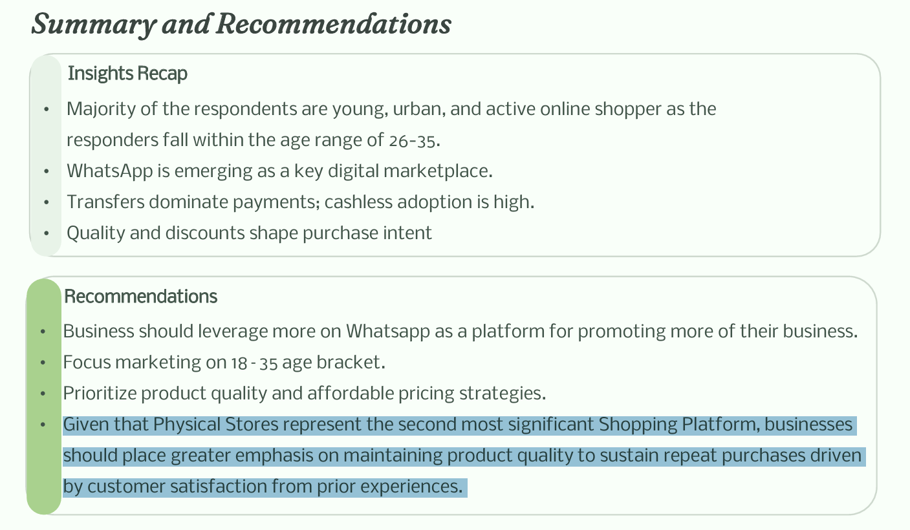

# Abdulhamid_Portfolio
##  Introduction

Hello! I'm **Abdulhamid**, a recent graduate with a passion for transforming data into actionable insights. My journey into data analysis began with a desire to sharpen my analytical thinking and develop skills that bridge the gap between raw data and strategic business decisions. Through dedicated learning and hands-on practice, I've built a strong foundation in Excel-based data analysis and i am actively working toward becoming a proficient Business/Data Analyst.

This portfolio showcases projects that demonstrate my ability to clean, analyze, and visualize data to deliver clear and impactful insights.

---
### Project 1: Buying Behaviour of Nigerians (Analysis and Dashboard)

**Objective:** To understand the factors influencing Nigerian consumer purchasing decisions. My analysis here provides actionable insights to guide Nigerian small scale business on their marketing strategies and retail decisions.

**Approach:**
- **Primary Data Collection:** Designed and distributed a Google Forms survey targeting respondents across various age groups, genders, and locations in Nigeria.
- **Data Cleaning & Preparation:** Exported survey responses to Excel and performed thorough data cleaning by removing inconsistencies and errors, handling missing values, and standardizing formats for accurate analysis
- **Analysis & Visualization:** Applied descriptive statistics, leveraged IF and nested IF functions for data categorization, and created dynamic Pivot Tables to uncover consumer behavior patterns
- **Dashboard Creation:** Built an interactive dashboard featuring pie charts, donut charts, clustered column charts, and line charts to visualize key trends and insights
- **Presentation Development:** Created a simple PowerPoint presentation to communicate findings, insights, and strategic recommendations to stakeholders

**Tools Used:** Microsoft Excel (IF Functions, Nested IF, Pivot Tables, Descriptive Statistics, Data Visualization), Google Forms, Microsoft PowerPoint

*For detailed insights and full recommendations, view the presentation deck below.*

**Project Deliverables:**

**Excel Dashboard:**

*Interactive dashboard showing consumer behavior patterns and trends*

**Presentation Highlights:**

*Key insights and recommendations presented for stakeholders*

**[View Excel Analysis](files/Buying-Behaviour-of-Nigerians-Analysis-and-Dashboard.xlsx)**

**[View Presentation (PDF)](files/BUYING-BEHAVIOUR-OF-NIGERIANS-PRESENTATION-SLIDES.pdf)**

---

### Project 2: Superstore Sales Performance Analysis

**Objective:** To analyze overall sales performance across different regions, categories, and customer segments to identify top-performing products and areas for revenue growth.

**Approach:**
- **Data Analysis:** Leveraged a clean superstore dataset containing order details, customer information, product categories, and financial metrics (sales, profit, discount)
- **Pivot Table Analysis:** Created multiple pivot tables to examine sales trends across regions, product categories, customer segments, and time periods
- **Dashboard Development:** Built an interactive Excel dashboard with dynamic visualizations to track key performance indicators and sales patterns
- **Presentation Creation:** Developed a PowerPoint presentation communicating findings and strategic recommendations to stakeholders

**Project Deliverables:**

**Excel Dashboard:**
**[View Excel Analysis](files/WEEK-5-PROJECT.xlsx)**

**Presentation Slide:**
**[View Presentation (PDF)](files/WEEK-5-PROJECT-PRESENTATION-SLIDES.pdf)**

---

### Project 3: Employee Performance and Departmental Insights Report

**Objective:** To provide actionable insights from 200 employee records across Finance, HR, IT, and Sales departments. This data-driven analysis examines workforce demographics, performance distribution, compensation structure, and eligibility metrics to inform HR leaders and senior managers on retention strategies and pay equity opportunities.

**Approach:**
- **Data Cleaning & Preparation:** Cleaned and validated employee records to ensure data accuracy and consistency across all departmental metrics
- **Advanced Analysis:** Applied filtering and sorting techniques combined with advanced lookup functions (VLOOKUP, HLOOKUP, XLOOKUP, INDEX-MATCH) to cross-reference employee data, retrieve departmental compensation benchmarks, and identify performance patterns
- **Performance Segmentation:** Categorized employees into performance tiers to assess distribution and identify high performers versus areas requiring improvement
- **Compensation Analysis:** Examined salary structures across departments to uncover pay disparities and opportunities for equity adjustments
- **Presentation Development:** Created a comprehensive PowerPoint presentation to communicate workforce insights and strategic HR recommendations

**Tools Used:** Microsoft Excel (VLOOKUP, HLOOKUP, XLOOKUP, INDEX-MATCH, Filtering & Sorting, Data Cleaning), Microsoft PowerPoint

**Project Deliverables:**

**Excel Analysis:**
**[View Excel Analysis](files/WEEK-4-PROJECT.xlsx)**

**[View Presentation (PDF)](files/Employee-Performance-Insights.pdf)**

---
